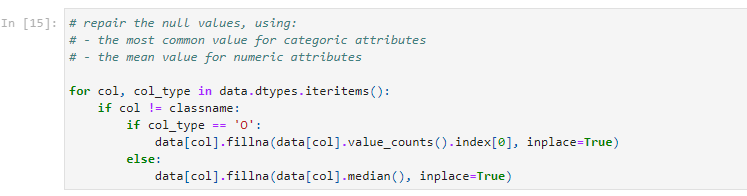
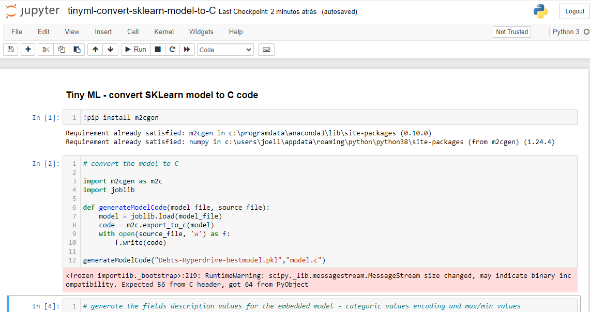

# Machine Learning for recovery of debts in telephony

The objective of this project is to create machine learning models that can help with the task of debt recovery in the telephony area, allowing the estimation of debts with the greatest potential for payment, in order to take related actions, as communication with the debtor through telemarketing operators, mailing, SMS, Whatsapp with targeted offers to pay off the debt.
To accomplish the task, Azure ML will be used in two models: one model obtained using AutoML and one SKLearn customized model whose hyperparameters are tuned using HyperDrive. Next, the two models will be compared in terms of performance, and the best model will be deployed as a webservice in ACI, with a demonstration of how to consume the REST endpoint with authorization enabled. 
Additionally, the following features were added to the minimum project flow:
- the best AutoML model was deployed in serverless mode, using an Azure Function.
- the best Hyperdrive model was deployed on an embedded device with low processing capacity, using a technology called TinyML.

The general project diagram can be seen below:

## Project Set Up and Installation
This project consists of 4 jupyter notebooks that must be executed on a compute instance in AzureML.
Additionally, the dataset, environment configuration files, training script and models saved in pkl and onnx format are also provided in this github repository.

## Dataset

The dataset used corresponds to a real database of a large telephone operator in Brazil.
Confidential and personal data were duly deleted, leaving only generic attributes that do not identify the debtors.
The dataset has 848,091 rows with 10 attributes and a class column.
Many records have null values ​​and seemingly spurious values, typically found on a production databases. Therefore, a data cleaning process must be carried out prior to training.
The database presents a severe class imbalance, with only 43,402 payments made,so only 5.39% of records are in the "yes" class.
Another point to note is that several columns have categorical values, and for proper use with SkLearn library, it must be converted using one hot encoding or label encoding.
The geografic distribution of the data in Brazilian territory can be observed below:

### Overview

This database was obtained from a credit recovery consultancy a few years ago, and corresponds to real records on which collection actions must be taken. The main task consists of identifying the records most likely to be paid, and use the machine learning models to predict future behavior.

### Task and Exploratory analysis

The proposed task is binary classification ("yes/no"), indicating the probability of a debt being paid taking into account the input attributes.
The input attributes are:

- TIPO_PES -  type of person, natural or legal
- SEXO_PES - gender of person
- ESTADO_CIVIL_PES - civil status of person
- IDADE - age of person
- VALOR_TOTAL - total value of the debt
- ATRASO - days of debt delay
- NOME_TIPE - address type
- TEVE_DEVOL - indication of correspondence returned to the debtor's address
- CIDADES - city of person
- UF - state of person
- RESULTADO - Class - S for paid debt and N for unpaid

A exploratory view of the first rows in the dataset can been seen below:

There is a lot  of null values, that are handled with the following code:

Another point to note are the columns with categorical values, such as CIDADES, that must be converted with One hot encoding or Label encoding.

Considering that the column "CIDADES" has 2,599 distinct values, it was opted to use label encoding instead one hot encoding, as this will result in 2,599 new columns.
With label encoding, each one of the values are assigned to a number (0,1,2,3...) and stored in just one column, with this code:

The Class imbalance was initially addressed using the class_weight ='balanced' parameter, available in most SKLearn machine learning algorithms.
For instance, in LogisticRegression documentation:

### Baseline comparation

As a basis for comparing the classification performance that can be obtained with standard algorithms from the SKLearn library with default parameters (except the class balance parameter), 5 algorithms were tested:
- LogisticRegression
- SVC
- DecisionTree
- NB
- KNN

The results obtained were:

As seen in the chart, the best algorithm for the dataset was DecisionTree, with Accuracy of 0.996 and AUC of 0.980, a very good score for a model that is relatively simple to obtain.
This will be the algorithm to be used for tuning hyperparameters with Azure Hyperdrive.

The details of the data analysis, cleaning process and the baseline classifiers can been inspected in the notebook "dataset-exploratoryanalysis-baseline.ipynb".

### Access

The datafile without confidential and personal data, but with null values and with original categorical values (without the Label encoder step from notebook) is available in a CSV tabular file called "Debts.csv", with separator ";" (semicolon), that was uploaded to the following website URL:

https://www.jlnsoftware.com.br/azure_ml/Debts.csv

This URL will be used in the AzureML (AutoML and Hyperdrive) with the class TabularDatasetFactory to load the data for the experiments.

### Metric for best model

Considering the class imbalance, the metric for choosing the best model used in the project for the AutoML and Hyperdrive experiments will be AUC_weighted metric, which is the arithmetic mean of the score for each class, weighted by the number of true instances in each class, which is more appropriate than accuracy in this context.

## Automated ML

The AutoML experiment used the following configuration:
- Task classification, with label column RESULTADO.
- Maximum of 60 minutes of execution (in practice, it takes almost 102 minutes, because of data preparation (statistics) and featurization steps, not included in the experiment maximum time).
- Max concurrent iterations of 5, since it was executed in a cluster with 6 nodes DS3-V2 (4 cores -	14 GB RAM).
- Flag enable_onnx_compatible_models, to allows to export the best model in ONNX format.
- Flag Enable early stopping enabled.

The AutoML experiment can be seen below:

Here it can be note that:
- the experiment rans for 1h42min, and was finished by the early termination since no improvement was found for 10 iterations.
- The best AUC weigted metric was 0.999846, in a Voting Ensemble algorithm.

The run details widget in the notebook from this experiment is: 

The total number of iterations was 56.

And the best model details:

It is a Voting Ensemble with 2 classifiers.

### Results

The result of the AutoML experiment is very good, above of the baseline and very close to 100% of correct classifications, but it could be improved by not allowing early termination, increasing the experiment timeout, customizing the featurization or checking the "Enable deep learning" option (requires a GPU).

## Hyperparameter Tuning

For the Hyperdrive parameters tuning, the DecisionTree algorithm was chosen, since it has the best performance in the exploratory analysis against other 4 types of classifiers in SKLearn Library with standard hyperparameters.
So, the idea for the Hyperdrive experiment is to tune some of the DecisionTree hyperparameters listed bellow and see if it is possible to improve the performance, or at least to reduce the complexity of the model.
The parameter class_weight was used with the fixed value 'balanced', to deal with class imbalance by using the values of y to automatically adjust weights inversely proportional to class frequencies in the input data.
The parameters to be tuned in a random parameter sampling are:
- criterion: The function to measure the quality of a split. Choice between 'gini' and 'entropy'.
- splitter: The strategy used to choose the split at each node. Choice between 'best'and 'random'.
- max_depth: The maximum depth of the tree. If zero, then nodes are expanded until all leave. Choice between 0,10,100 and 200.
- min_samples_split: The minimum number of samples required to split an internal node. Choice between 2,5,10 and 20.
- min_samples_leaf:  The minimum number of samples required to be at a leaf node. Choice between 1,5,10,20.

The metric used was AUC_weighted, to allow the results to be compared with the AutoML experiment and the baseline.
The early termination policy was a BanditPolicy, that finishes runs based on slack criteria, a frequency and a delay interval for evaluation, with the intention to stop runs that are not converging to better results.
The artifacts required to execute the Hyperdrive tuning (available in the "hd_source" folder in this Github repository) are:
- the train.py script, which performs training with the DecisionTree classifier with the hyperparameters indicated on the command line.
- the conda environment dependency file (yml).
The experiment was executed for 60 minutes (same time of AutoML experiment), with maximum of 5 simultaneous runs in the same compute cluster of 6 nodes.

The Hyperdrive experiment can be seen below:

Here it can be note that:
- the experiment rans for 1h1min, and was finished by the timeout, since the maximum time allowed was 60 minutes.
- The early termination policy configured, the parameters space and the primary metric.

The run details widget in the notebook from this experiment is: 

The total number of trials was 17, and the best metric was 0.98739057 - lower than the best AutoML model.

And the best model details:

It uses the following hyperparameters: criterion=entropy, splitter=best, max_depth=0, min_samples_leaf=5 and min_samples_split=5.

### Results

The results are a little worse than the AutoML experiment (0.98739057 x 0.999846), and a little better than the baseline performance (DecisionTree with default hyperparameters - 0.980407).
The reasons for this could be the small number of trials (only 17) during the 60 minutes, with each execution taking between 10-15 minutes on the nodes, which is a lot of time and was probably caused by the loading and parsing of a large datafile downloaded from internet each time.
So, if the experiment time was adjusted to a few hours longer, or the training script had access to the datafile locally and used Pandas directly to read the CSV, the experiment could have achieved better results.
Other improvements includes adding new values ​​in the existing hyperparameters or adding new hyperparameters that the Decision Tree classifier supports.

## Model Deployment

The best model between the two experiments was the AutoML, as expected, since it is capable of creating complex ensembles of classifiers and using voting between them.
So, the model deployed is the AutoML best model, as seen in the screen below in "Heathy" state, with the REST endpoint and the application insights enabled:

This endpoint publication was completely automated by the script snippet below:

To get the conda environment configuration - env.yml and the score.py script, the best model was downloaded in the Azure ML web interface.

And here is the AzureML suggested consumption code to query the REST endpoint, sending the input attributes in JSON format, in this case ​to classify an input as 1-positive:

## Screen Recording

Additionally, a screencast was provided with the following main points of the project:
- The dataset Debts.
- The AutoML experiment.
- The Hyperdrive experiment.
- The saved models.
- The best model deployed in a endpoint in an automated way and an API call to model REST endpoint.

The screencast does not contain audio, but it contain subtitles in English describing each project steps above.

The screencast is available at the link:

https://vimeo.com/951244432?share=copy

To enable the subtitles, please click in icon "CC" and select "English". To change the resolution to 1080p, click in the gear icon and select "quality"="1080p".

## Standout Suggestions

### Serverless model deployment

Although AzureML offers the ability to automatically publish the model to ACI and AKS, one option that is not currently available is serverless publishing using Azure Functions.
In serverless mode, it is not necessary to pay for a resource 24/7, it is used in "pay as you go" model, so the application "goes up" when a web call is made, and "goes down" tipically in 5-10 minutes later if not used within this period of time.
This is a good option for cases where:
- The model is small, so it can go up very fast, and runs on "light" hardware (in Consumption plan of Azure Functions, it is limited to 1.5 Gb of RAM and 1 CPU).
- the model is used sparsely, and waiting a few seconds to launch the application is acceptable.
- the project´s financial resources are limited and do not include the placement of a dedicated server/container.

Considering this need, the "score.py" script code to perform inferences in the AutoML best model was adapted to work as an Azure Function in Python 3.8 using Visual Studio Code extensions:

So, the Azure Function was published to the public address https://debts-automl.azurewebsites.net/api/http_trigger and the response time varies from 30 seconds (in the case where it is necessary to put the application "up" again) to less than 300 ms if the application is already loaded:
 

In this way, the monthly consumption to have the model published in cases of sporadic calls will be very low, even lower than using a low capacity container in the ACI.

### TinyML

Even though the model generated by AutoML is slightly better, the DecisionTree model tuned by Hyperdrive has a very impressive performance on this real-world dataset.
The decision tree classifier concept is something quite intuitive, where the nodes are conditions on the input attributes, and the leaves are classes, as in the example below:

It is also possible to note that a decision tree can be easily converted into the source code in any language as a set of chained "ifs", as opposed to the best AutoML model, which is a complex ensemble of of several classifiers.
Considering this, the challenge of converting the best hyperdrive decision tree model into a code that can run on an embedded device with low processing capacity was proposed as an additional work, in a technology called TinyML.

What's TinyML?
TinyML is the overlap between Machine Learning and embedded (IoT) devices, a type of machine learning techniques that allows models to run on smaller, less powerful devices. 
In the specific case of this project, the idea is to convert a Decision Tree model optimized by AzureML HyperDrive to a simple code in a language like C and deploy this model on a cheap hardware, so that that the model can work offline and run inferences.
For this task, the library M2cgen (https://github.com/BayesWitnesses/m2cgen/tree/master) was used, which supports a large number of languages (C, C#, Java, JavaScript, PHP, Python) and SKLearn models (DecisionTreeClassifier, LogisticRegression, LinearSVC,RandomForestClassifier).
The notebook below is capable of converting a serialized SKLearn model in pickle format to a C source code:

The points to note about the generated code are:

- It has a function called "score", that receives the 10 inputs as as vector of double values and returns a double vector with the class probabilities as response (in this case, 2 probabilities, for class 0 and 1).
- As expected, the source code is composed of "chained ifs" about attributes conditions:

- However, it's an extremely long source code, with 6,02 MB (almost 150 A4 pages), so not all low-cost embedded devices will be able to run this model.

The hardware choosen to run the model is the ESP32, a very common SoC used in IOT projects around the world because it offers a dual core processor, wifi/bluetooth connection and can run small scripts that typically capture data from sensors and send it over the network.

Specifically, the ESP-WROOM-32 kit is used, wich includes a minimal board with USB-serial chip to program the device and a small built-in OLED display with 0.96 inch size to show messages for the incredible price of US$6:

The hardware specification of this device is:

Despite not being very slow (the clock is 240 Mhz) and having a WiFi/Bluetooth connection, the device's RAM memory is small for the today standards, with only 512 Kb, so it must be used with care.

In addition to this kit with the OLED screen, a 16-keys numeric keypad seen below was used to allow the user to interact with the device:

The programming of this device is done with Arduino IDE in C language.

In addition to the model's C code, it is necessary to create a simple flow of screens that asks the values ​​of the input attributes and that displays the classification output value.
The idea is to use the simple 16 keys keypad to enter the input attributes as follows:
- for numeric attributes, the user must enter the value and click on "#" to finish.
- for categorical attributes, an index was provided containing the possible values of the attribute that can be entered, for example:
Attribute: SEXO_PES - Type: object
Values:
0 -  
1 - F
2 - M
3 - U
if the user wants to enter the value "F", they must press the key 1 in the keypad and click "#" to finish.

The metadata for the classification program is implemented in a JSON file, to allow easy adaptation of the same source code to another model:

The developed software was implemented in 6 classes: the main sketch, which contains 2 main functions (setup to initialize the program and loop to implement the main program loop), an App class that deserializes the metadata JSON file, TerminalApp that controls the user interface flow, KeyPadHelper to control the keypad, TelaOLED to control the OLED screen and Model.c which contains the model C code:

The compilation of the software uses 554,737 bytes (42%) of the firmware storage and 26,680 bytes (8%) of RAM memory.

The user interface for the TinyML project, running on an online microcontroller emulator called Wokwi (https://wokwi.com/) can be seen in the diagram below:

A prototype of the real physical device placed in a box printed on a 3D printer with PLA can be seen below:

So, it is possible to run a robust model, obtained from a dataset of almost 1 million records and which classifies more than 98% of the records correctly locally on a US$7 device!

## Conclusions

This project covered the application of machine learning in a real-world dataset for debt recovery with almost 1 million records where it was possible to obtain a metric greater than 0.98 with Hyperdrive and greater than 0.9998 with AutoML in AzureML. Additionally, the best model was published on a REST endpoint that can be easily consumed over the internet, and an alternative "low cost" serverless publish mode was proposed. Finally, the best model obtained from Hyperdrive was installed on IOT hardware costing less than US$7 that is capable of performing real-time inferences on the model locally, deployed as a C source code that implements the rules of a DecisionTree classifier.